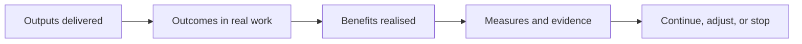

# Benefits register

Use this to define, measure, and confirm outcomes and benefits. Start it during planning, not after delivery.

## Rules

- Every benefit has an owner.
- Every benefit has a measure and a data source.
- Baselines should be captured early where possible.
- Reviews are scheduled and evidence is linked.

---

## Benefits table

| Benefit | Outcome link | Measure | Baseline | Target | Owner | Review dates | Status | Evidence link |
|---|---|---|---|---|---|---|---|---|

Status example: Not started, In progress, On track, At risk, Achieved, Not achieved.

---

## Measurement plan

**Data sources:**

**Collection method:** (manual, dashboard, system report)

**Cadence:** (monthly, quarterly, per release)

**Reporting audience:**

---

## Outcome review notes

For each review date, capture:

- What was expected to change?
- What actually changed?
- What evidence supports this?
- What explains any gap?
- What follow-up actions are needed and who owns them?

---

## Illustration

You can also embed the site SVG:  
`/img/projectops/outcome-traceability.svg`
