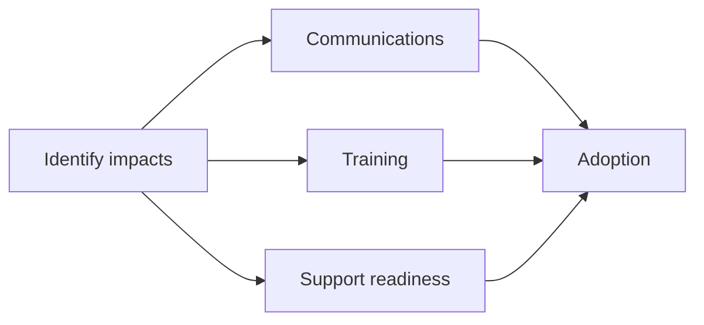

# Change impact assessment

Use this to identify who is impacted and what must be ready for successful adoption. Update it as scope changes.

## 1. Summary

**Change description:**

**Release window(s):**

**Primary impacted groups:**

---

## 2. Impact register

| Area | Impact description | Who is impacted | Impact level | Risk | Mitigation | Owner |
|---|---|---|---|---|---|---|
| Process | | | Low / Medium / High | | | |
| Roles and capability | | | | | | |
| Systems and access | | | | | | |
| Data and reporting | | | | | | |
| Policy and compliance | | | | | | |
| Support and operations | | | | | | |

---

## 3. Stakeholder engagement plan

| Group | What they need | Channel | Frequency | Owner | Notes |
|---|---|---|---|---|---|

---

## 4. Communications plan

| Audience | Message | Channel | Timing | Sender | Feedback capture |
|---|---|---|---|---|---|

---

## 5. Training and enablement

| Audience | Required capability | Format | Materials | Delivery date | Owner | Completion evidence |
|---|---|---|---|---|---|---|

---

## 6. Readiness checks

Use this to drive a go or no-go decision.

| Readiness area | Evidence required | Owner | Status | Notes |
|---|---|---|---|---|
| Comms delivered | | | | |
| Training ready | | | | |
| Support model ready | | | | |
| Access and permissions | | | | |
| Process updates | | | | |
| Known issues accepted | | | | |

---

## Illustration

You can also embed the site SVG:  
`/img/projectops/release-readiness.svg`
