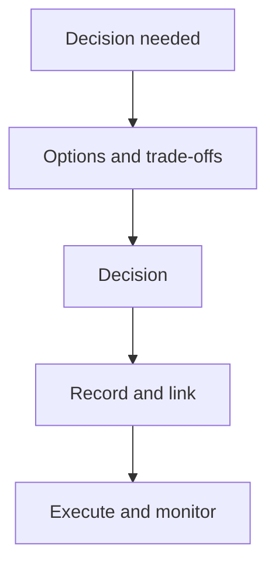

# Decision log

Use this to capture decisions while they are fresh. Decisions that affect scope, delivery, risk, readiness, or benefits should be recorded.

## Rules

- Record decisions at the time they are made.
- Link the decision to work items and affected documents.
- Record the rationale, not just the outcome.

---

## Decision log table

| Date | Decision | Category | Context | Options considered | Decision maker | Rationale | Impacts | Links |
|---|---|---|---|---|---|---|---|---|

Category examples: scope, technical, risk acceptance, governance, release, benefits.

---

## Decision record (optional detail)

Use this format when a decision is high impact or controversial.

**Decision:**

**Date:**

**Decision maker:**

**Context:**

**Options considered:**
- Option A:
- Option B:
- Option C:

**Rationale:**

**Impacts:**
- scope:
- timeline:
- risk:
- readiness:
- benefits:

**Follow-up actions:**

**Links:** (brief, requirements, work items, release notes)

---

## Illustration

You can also embed the site SVG:  
`/img/projectops/decision-flow.svg`
