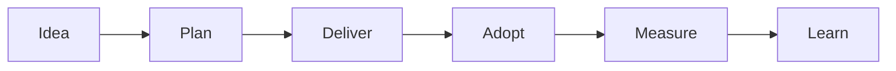

# Project brief

Use this to define intent, boundaries, ownership, and success measures. Keep it short and decision-focused.

Embed this template in your docs tool and link everything else to it.

## Header

| Field | Value |
|---|---|
| Initiative name | |
| Sponsor | |
| Outcome owner | |
| Delivery lead | |
| Change lead | |
| Technical lead | |
| Operations owner | |
| Start date | |
| Target release window | |
| Status | Draft / Approved / In delivery / Released / Measuring |

---

## 1. Problem and context

**Problem statement:**

**Why now:**

**Constraints:** (budget, time, policy, platforms, security, resourcing)

---

## 2. Outcomes and measures

Describe what will be different in real work.

**Outcome statement:**

**Success measures:**

| Measure | Baseline | Target | Owner | Data source | When measured |
|---|---|---|---|---|---|

**Non-functional outcomes:** (safety, resilience, accessibility, privacy)

---

## 3. Scope boundaries

### In scope
-

### Out of scope
-

### Assumptions
-

### Dependencies
| Dependency | Owner | Needed by | Risk if late | Mitigation |
|---|---|---|---|---|

---

## 4. Delivery approach

**Approach:** Agile / Waterfall / Hybrid

**Delivery cadence:** (iterations, milestones, or both)

**Release strategy:** (single release, staged, feature flags, pilot)

**Definition of done (minimum):**
- Acceptance criteria met
- Testing completed
- Operational handover requirements met
- Release notes prepared
- Comms and training ready (or scheduled)

---

## 5. Change and adoption (early view)

**Who is impacted:**

**Key change impacts:** (process, roles, systems, policy, training, support)

**Adoption risks:**

---

## 6. Benefits and value tracking

**Benefits register link:**

**First outcome review date:** (suggested: 30 days after release)

---

## 7. Decisions needed

List upcoming decisions that require sponsor or governance involvement.

| Decision | When needed | Owner | Notes |
|---|---|---|---|

---

## Illustration

You can also embed the site SVG:  
`/img/projectops/lifecycle-flow.svg`
