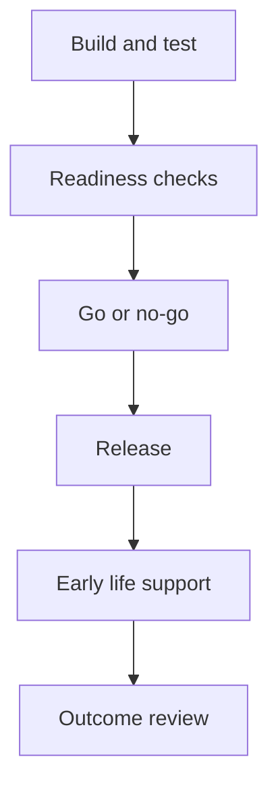

# Release readiness checklist

Use this before any release, go-live, pilot, or cutover. Keep it short and evidence-led.

## Release details

| Field | Value |
|---|---|
| Release name | |
| Date and time window | |
| Environments affected | |
| Delivery lead | |
| Change lead | |
| Operations owner | |
| Support roster | |

---

## Checklist

| Area | Check | Evidence | Owner | Status |
|---|---|---|---|---|
| Scope | Release scope confirmed | | | |
| Quality | Acceptance criteria met | | | |
| Quality | Testing complete | | | |
| Risk | Known issues documented and accepted | | | |
| Operations | Monitoring and alerts ready | | | |
| Operations | Support and escalation paths confirmed | | | |
| Change | Comms delivered or scheduled | | | |
| Change | Training delivered or scheduled | | | |
| Safety | Rollback or mitigation plan confirmed | | | |
| Governance | Go or no-go decision recorded | | | |

Status: Not started, In progress, Done, Blocked, Accepted risk.

---

## Go or no-go decision record

**Decision:** Go / No-go / Go with reduced scope / Go with accepted risks

**Rationale:**

**Risks accepted:**

**Conditions:** (what must be done during early life)

---

## Illustration

